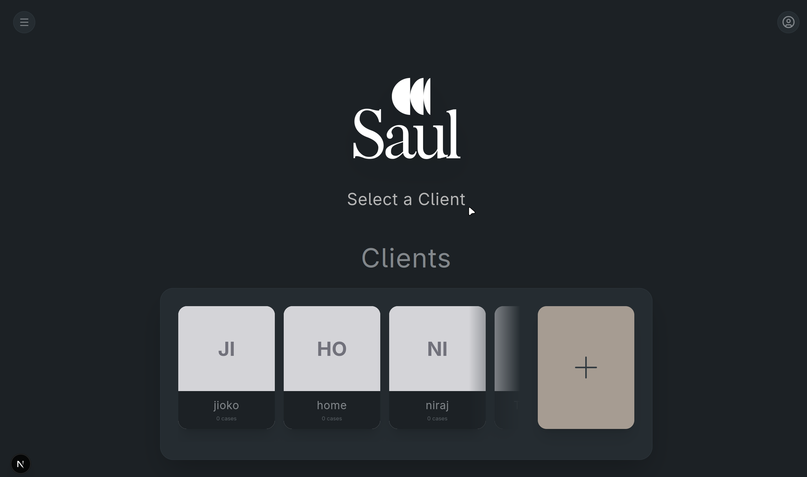
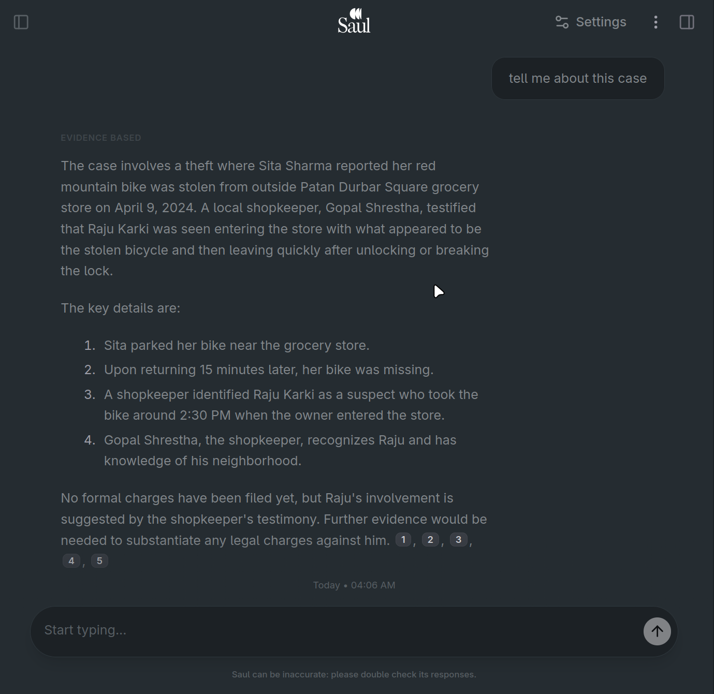
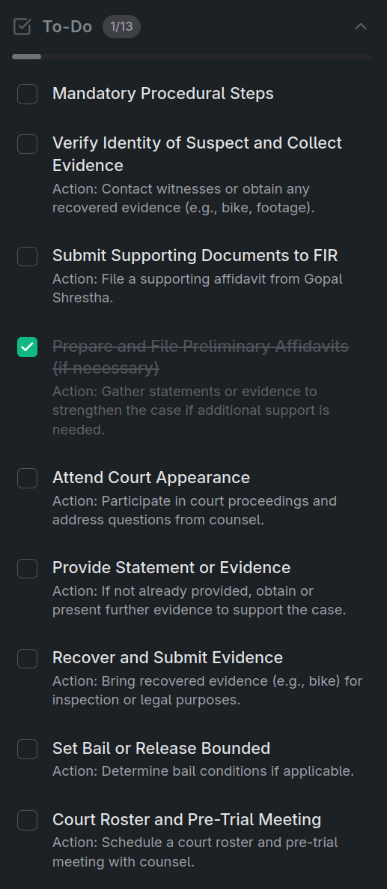
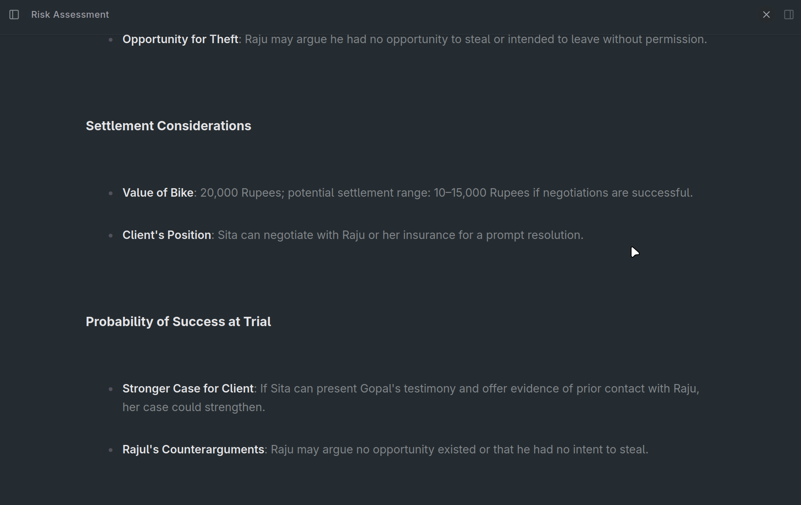
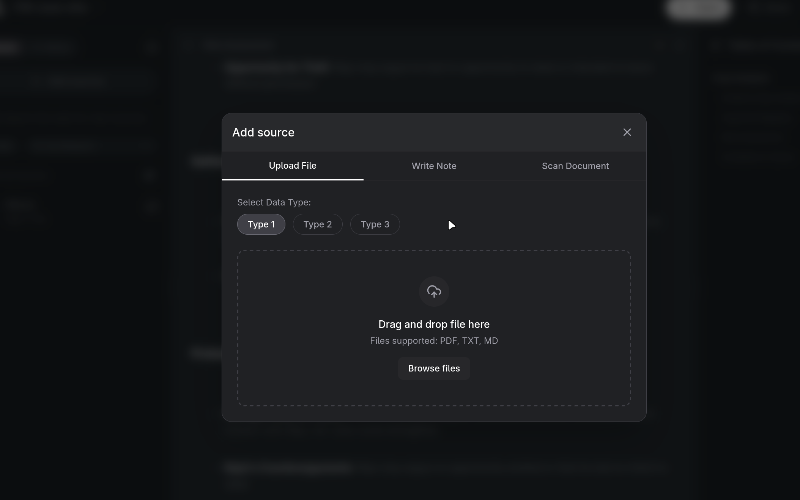

# ⚖️ Legal Intelligence System — Project Documentation

> **Hackathon:** CodeYatra 2.0 — Himalayan College of Engineering
> **Date:** February 22, 2026

---

## 🏷️ Team Information

| Field        | Details                        |
|--------------|--------------------------------|
| **Team Name**   | **Munchlax**                |
| **Project Name**| Legal Intelligence System   |
| **Hackathon**   | CodeYatra 2.0               |
| **Venue**       | Himalayan College of Engineering |

---

## 👥 Team Members & Roles

| # | Name | Role | Responsibilities |
|---|------|------|-----------------|
| 1 | **Rohan Singh** | Frontend Developer | UI/UX design, Next.js application, component architecture, chat interface, analytics dashboard, theme system |
| 2 | **Shailaj Dahal** | AI Developer | RAG pipeline design, LLM integration, embedding models, Judge evaluation loop, analytics AI prompts, Ollama setup |
| 3 | **Niraj Nath** | Backend Developer | FastAPI server, PostgreSQL database schema, API routing, document ingestion pipeline, ChromaDB vector store management |

---

## 📋 Abstract

The **Legal Intelligence System** is a locally-hosted, AI-powered legal research and case management platform built for lawyers, paralegals, and legal professionals. Developed during CodeYatra 2.0, the system leverages a **Retrieval-Augmented Generation (RAG)** architecture to provide accurate, context-grounded legal answers by combining local vector databases of law documents and past case precedents with a self-evaluating LLM pipeline.

Unlike cloud-based legal AI tools, this system runs entirely **on-premise** — meaning all sensitive client data, case documents, and legal files never leave the user's machine. The system uses **Ollama** to run open-weight large language models locally, ensuring privacy, cost-efficiency, and data sovereignty.

The platform enables lawyers to manage clients and cases, upload legal documents, chat with an AI legal assistant, and generate structured analytical reports — all from a single, modern web interface built with Next.js.

---

## ✨ Features

### 🗂️ Client & Case Management
- Create and manage client profiles with contact information
- Attach multiple legal cases per client
- Upload case files (FIRs, affidavits, contracts, etc.) directly to a specific case
- Visual case selector in the sidebar — switch between clients and cases instantly

### 💬 AI-Powered Legal Chat (RAG Q&A)
- Ask natural language questions about any legal matter
- The AI retrieves the most relevant law sections and past case precedents
- Responses are grounded in actual documents — hallucinations are detected and filtered by a Judge LLM
- Source citations are displayed alongside every answer (`[SOURCE 1]`, `[SOURCE 2]`, etc.)
- Confidence indicator (`High` / `Low`) on every response
- Model selector: **Briefing**, **Evidence-Based**, **Heavy-Duty** modes

### 📊 AI Analytics Engine (5 Report Types)
The Analytics panel generates structured, citation-backed reports on any case:

| Report | Description |
|--------|-------------|
| **Checklist** | Strategic to-do list & procedural checklist with deadlines and filings |
| **Gap Analysis** | Compares current evidence against the legal burden of proof and highlights weaknesses |
| **Argument Mapping** | Maps successful arguments from past precedents and identifies vulnerabilities |
| **Risk Assessment** | Qualitative probability of trial success vs. settlement benefits |
| **Compliance Tracker** | Flags approaching statutes of limitations, expired claims, and compliance deadlines |

### 📁 Document Ingestion
- Upload `.txt`, `.pdf`, `.md` files into three separate vector databases:
  - **Law Reference DB** — statutes, codes, constitutional excerpts
  - **Case History DB** — past court rulings and legal precedents
  - **Client Cases DB** — individual client case documents
- Section-aware chunking for law documents (splits on `Article X` / `Section Y`)
- Token-overlap chunking for general documents

### 💾 Chat History & Sessions
- Chat sessions are automatically saved (debounced 2 seconds after last message)
- Session history panel in the sidebar — reload any past conversation
- Sessions are stored locally in the browser

### 🔗 Source Viewer
- Sources panel shows all documents loaded into the system
- Click any source to preview its content directly in the interface
- Supports text file rendering in-app

### 🌗 Theme System
- Full light/dark mode toggle
- Persistent theme preference

---

## 🤖 AI, LLM & RAG Pipeline — Detailed Description

### Architecture Overview

The system is built around a **5-stage Agentic RAG pipeline**:

```
User Query
    │
    ▼
[1] RETRIEVAL      → Embed query → Search ChromaDB (Law + Cases + Client DBs)
    │
    ▼
[2] RANKING        → Sort by vector similarity distance, assemble context window
    │
    ▼
[3] GENERATION     → DeepSeek-R1 generates answer grounded in retrieved context
    │
    ▼
[4] EVALUATION     → Judge LLM scores the response (1–10) for grounding & helpfulness
    │
    ▼
[5] RETRY LOOP     → If score < 7, regenerate with feedback (up to 3 retries)
    │
    ▼
Final Response with Sources + Confidence Score
```

---

### 🔵 Stage 1 — Embedding & Retrieval

**Component:** `retrieval/search.py` → `QuerySearcher`

When a user submits a query, it is converted into a **dense vector embedding** using:

- **Model:** `mxbai-embed-large:latest` (via Ollama)
- This high-dimensional embedding captures the semantic meaning of the question

The embedding is then used to perform an **approximate nearest-neighbour search** across three **ChromaDB** vector collections simultaneously:

| Collection | Contents |
|------------|----------|
| `law_reference_db` | Statutes, civil code, criminal code, constitutional articles |
| `case_history_db` | Past court rulings, judgements, precedents |
| `client_cases_db` | Uploaded FIRs, affidavits, contracts for the active client case |

The top-K most semantically similar chunks are returned from each collection.

---

### 🟡 Stage 2 — Ranking & Context Assembly

**Component:** `retrieval/ranker.py` → `ResultRanker`

- Results from all three databases are merged into a single list
- Sorted by **vector distance** (lower distance = higher similarity)
- Assembled into a structured **context string** with explicit source labels:

```
[SOURCE 1] Civil_Code.txt (2024-01-01)
Type: law_section
Section 4. Any person who...

[SOURCE 2] Affidavit.txt (Unknown Date)
The petitioner hereby states that...
```

Only the top-5 most relevant chunks are passed to the LLM to keep the context window focused.

---

### 🟢 Stage 3 — Generation (LLM)

**Component:** `generation/llm.py` → `GeneratorLLM`

**Model:** `deepseek-r1:7b-qwen-distill-q4_K_M` (running locally via Ollama)

The generator uses a strict system prompt:

> *"You are a legal research assistant. Answer the user's question using ONLY the provided legal context. Cite your sources explicitly using [SOURCE N]. If the context does not contain sufficient information, say so clearly. Do not speculate or add information not present in the context."*

The LLM takes the assembled context + user query and generates a cited, grounded legal response.

**Key design decision:** The model is instructed to refuse to answer if context is insufficient — this prevents hallucination of legal facts, which could cause serious harm in a legal context.

---

### 🔴 Stage 4 — Evaluation (Judge LLM)

**Component:** `evaluation/judge.py` → `EvaluatorJudge`

**Model:** `deepseek-r1:7b-qwen-distill-q4_K_M` (same model, different role)

A separate LLM call acts as a **self-evaluating judge**. It receives the original question, retrieved context, and the generated response, then outputs structured JSON:

```json
{
  "score": 8,
  "is_helpful": true,
  "is_grounded": true,
  "hallucination_detected": false,
  "reason": "Response accurately cites Article 4 from provided context.",
  "suggestion": ""
}
```

| Field | Meaning |
|-------|---------|
| `score` | Quality score 1–10 |
| `is_helpful` | Is the response useful to the user? |
| `is_grounded` | Is every claim backed by the context? |
| `hallucination_detected` | Did the model invent facts? |
| `suggestion` | Feedback for improvement (used in retry) |

---

### 🔁 Stage 5 — Retry Loop (Self-Correction)

**Component:** `orchestrator.py` → `RAGOrchestrator`

If the judge scores the response **below 7**, the system automatically **retries** with the judge's suggestion appended as feedback to the generator prompt. This loop runs up to **3 times** (`MAX_RETRIES = 3`).

After all retries the **best-scoring attempt** is returned, with a `Low` confidence flag to alert the user.

This self-correcting agentic loop significantly improves response quality without human intervention.

---

### 📊 Analytics Pipeline

**Component:** `analytics_orchestrator.py` → `AnalyticsOrchestrator`

The analytics engine operates as a **specialized RAG pipeline** for structured report generation:

1. Fetch all chunks belonging to the active `client_case_id` from ChromaDB
2. Use the first 1000 characters of the case as a search query
3. Retrieve top-7 results from `law_reference_db` + `case_history_db`
4. Select a role-specific system prompt based on analytics type (Checklist / Gap Analysis / Argument Mapping / Risk Assessment / Compliance Tracker)
5. Generate a structured **Markdown report** with explicit citations
6. Return report + formatted source list

---

### 🗄️ Vector Database — ChromaDB

- **Storage:** `backend/data/chroma/` (persistent on-disk)
- Three isolated collections prevent cross-contamination between law, cases, and client data
- Each document chunk is stored with rich metadata: `source_file`, `doc_type`, `chunk_type`, `chunk_index`, `effective_date`, etc.
- ChromaDB's cosine-distance search enables sub-second semantic retrieval even on commodity hardware

---

### 📐 Document Ingestion Pipeline

**Component:** `ingestion/` — Parser → Chunker → Metadata Extractor → Embedder

| Step | Module | Action |
|------|--------|--------|
| Parse | `parser.py` | Read raw text from `.txt`, `.pdf`, `.md` files |
| Chunk | `chunker.py` | Section-aware splitting (law) or token-overlap (general) |
| Metadata | `metadata.py` | Extract titles, dates, document types |
| Embed | `embedder.py` | Generate `mxbai-embed-large` embeddings → upsert into ChromaDB |

**Law document chunking** uses regex to split on `Article X` / `Section Y` boundaries — preserving the legal structure rather than arbitrarily breaking mid-section.

**Token-overlap chunking** (512 tokens, 50-token overlap) ensures that information spanning chunk boundaries is represented in both adjacent chunks.

---

### 🛠️ Technology Stack

#### Backend
| Technology | Version | Purpose |
|------------|---------|---------|
| Python | 3.11+ | Primary language |
| FastAPI | Latest | REST API framework |
| Uvicorn | Latest | ASGI server |
| PostgreSQL | 15+ | Client/case relational data |
| ChromaDB | Latest | Vector store for embeddings |
| Ollama | Latest | Local LLM runtime |
| DeepSeek-R1 (7B Q4) | `deepseek-r1:7b-qwen-distill-q4_K_M` | Generation + Evaluation LLM |
| mxbai-embed-large | `mxbai-embed-large:latest` | Embedding model |
| Pydantic | v2 | Data validation & settings |
| psycopg2 / asyncpg | Latest | PostgreSQL drivers |

#### Frontend
| Technology | Version | Purpose |
|------------|---------|---------|
| Next.js | 15 | React framework (App Router) |
| TypeScript | 5+ | Type-safe development |
| Tailwind CSS | 4 | Utility-first styling |
| Framer Motion | Latest | Animations and transitions |
| Lucide React | Latest | Icon library |
| Radix UI | Latest | Accessible UI primitives |

---

## 🚀 Setup & Installation

### Prerequisites
- **Node.js** (v18+) & **npm**
- **Python** (v3.11+)
- **PostgreSQL** database running
- **Ollama** installed with models pulled:
  ```bash
  ollama run deepseek-r1:7b-qwen-distill-q4_K_M
  ollama pull mxbai-embed-large:latest
  ```

### 1. Backend Setup (FastAPI)
Navigate to the `backend` directory and install the requirements:
```bash
cd backend
python -m venv .venv
source .venv/bin/activate  # Or `.venv\Scripts\activate` on Windows
pip install -r requirements.txt
```

Start the FastAPI server:
```bash
uvicorn main:app --port 8000 --reload
```
The API should now be running locally at `http://localhost:8000`.

### 2. Frontend Setup (Next.js)
In a new terminal, navigate to the `frontend` directory:
```bash
cd frontend
npm install
```

Start the development server:
```bash
npm run dev
```
The Next.js app will be accessible at `http://localhost:3000`.

---

## 📸 Results

> **Note:** Replace the placeholder image paths below with actual screenshots from your running application.

### Screenshot 1 — Landing / Home Page


*The landing page featuring a clean, dark-themed interface with the Legal Intelligence System logo.*

---

### Screenshot 2 — AI Legal Chat (RAG Q&A)


*The main chat interface showing a user asking a legal question. The AI assistant responds with a grounded answer, citing `[SOURCE 1]` and `[SOURCE 2]` from the retrieved law documents. The confidence indicator is displayed as* ***High.***

---

### Screenshot 3 — Analytics Dashboard (Checklist Report)


*The right sidebar displaying a generated Checklist analytic report for a client case. The AI has produced a structured to-do list with procedural steps, deadlines, and citations to relevant statutes.*

---

### Screenshot 4 — Analytics — Risk Assessment Report


*The Risk Assessment analytic report showing a qualitative probability analysis of trial success versus settlement, backed by citations to past case outcomes from the vector database.*

---

### Screenshot 5 — Client & Case Management Sidebar


*The left sidebar showing client selection, case list, and case file upload. A lawyer can switch between clients, select active cases, and see case analytics results inline.*

---

### Screenshot 6 — Source Viewer & Document Upload


*The Sources tab showing uploaded documents (FIR, Affidavit, Law codes) with the ability to preview text content inline. New documents can be uploaded via drag-and-drop to expand the knowledge base.*

---

## 🗺️ System Architecture Diagram

```
┌─────────────────────────────────────────────────────────────────────┐
│                         FRONTEND (Next.js)                          │
│  ┌──────────────┐  ┌──────────────────┐  ┌──────────────────────┐  │
│  │  Left Panel  │  │    Chat Area     │  │   Right Panel        │  │
│  │  - Clients   │  │  - RAG Q&A chat  │  │  - Analytics Reports │  │
│  │  - Cases     │  │  - Source viewer │  │  - Checklist         │  │
│  │  - History   │  │  - Model select  │  │  - Gap Analysis      │  │
│  └──────────────┘  └──────────────────┘  └──────────────────────┘  │
└─────────────────────────┬───────────────────────────────────────────┘
                          │ HTTP / REST API
                          ▼
┌─────────────────────────────────────────────────────────────────────┐
│                      BACKEND (FastAPI)                              │
│  ┌──────────────────────────────────────────────────────────────┐  │
│  │                    RAG Orchestrator                          │  │
│  │  Query → Embed → Search → Rank → Generate → Judge → Retry   │  │
│  └──────────────────────────────────────────────────────────────┘  │
│  ┌──────────────┐     ┌───────────────┐     ┌───────────────────┐  │
│  │  PostgreSQL  │     │   ChromaDB    │     │     Ollama        │  │
│  │  - Clients   │     │  - law_db     │     │  - DeepSeek-R1 7B │  │
│  │  - Cases     │     │  - client_db  │     │  - mxbai-embed    │  │
│  │  - Files     │     │  - cases_db   │     │  (local runtime)  │  │
│  └──────────────┘     └───────────────┘     └───────────────────┘  │
└─────────────────────────────────────────────────────────────────────┘
```

---

## 🏁 Conclusion

The **Legal Intelligence System** by Team Munchlax demonstrates that powerful, privacy-preserving AI tools for specialized domains are achievable on consumer hardware. By combining a self-correcting agentic RAG pipeline, a local LLM runtime via Ollama, and a multi-type AI analytics engine, the system addresses real pain points in legal practice:

- **Time:** Lawyers spend hours searching through statutes and precedents. The RAG pipeline retrieves the most relevant context in under a second.
- **Accuracy:** The Judge LLM evaluation loop and mandatory source citations dramatically reduce the risk of AI hallucination in a domain where accuracy is critical.
- **Privacy:** Entirely on-premise — sensitive client data never leaves the firm's infrastructure.
- **Insight:** The 5 analytics report types turn raw case documents into actionable intelligence — checklists, risk scores, argument maps — in seconds.

The project was built end-to-end over a single hackathon session, covering a full-stack architecture from vector embeddings to a polished Next.js interface. The codebase is modular and production-extensible: new LLM models, new vector databases, and new analytics types can be added with minimal changes.

> **Team Munchlax** — Rohan Singh · Shailaj Dahal · Niraj Nath
> CodeYatra 2.0 | Himalayan College of Engineering | February 22, 2026

---

*Legal Intelligence System — Version 1.0*
